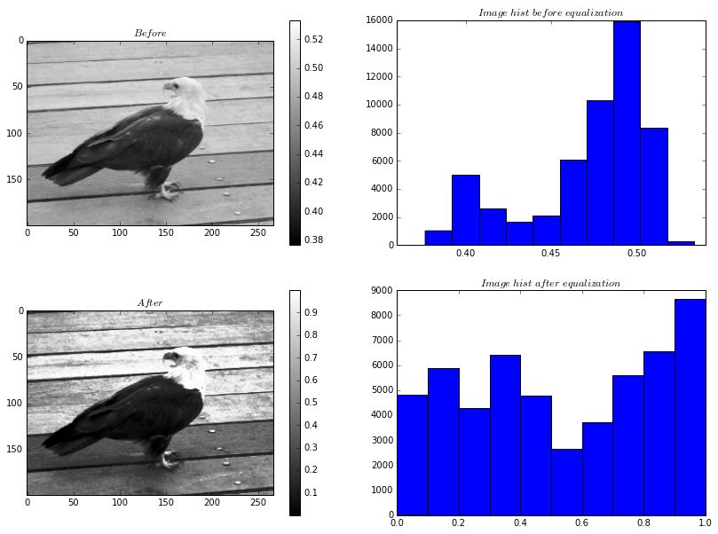

Статистика и визуализация

###################

:date: 2016-10-05 17:56

.. default-role:: code
.. contents:: Содержание

Генерация случайных чисел в Python
===================================

Генерация случайных чисел - очень важный, с прикладной точки зрения, инструмент.
Она используется в криптографии, при численном интегрировании - Метод Монте-Карло,
для семплирования выборок в машинном обучении, вероятностных алгоритмах,
имитационном моделировании (одно из самых известных тут распределение Пуассона) и многом-многом другом.

В набор стандартных библиотек Python включен модуль random,
который предназначен для генерации случайных чисел из различных распределений, примитивного семплирования,
перемешки данных и т.д.

Давайте рассмотрим основные функции этого модуля:

+--------------------------------------+------------------------------------------------------------------------------------------------------------------------------------------------------------------------------------------------------------------------------------------------+
| Функция библиотеки math              | Математическая функция                                                                                                                                                                                                                         |
+======================================+================================================================================================================================================================================================================================================+
| `random.seed([X], version=2)`        |  Инициализация генератора случайных чисел. Если X не указан, используется системное время.                                                                                                                                                     |
+--------------------------------------+------------------------------------------------------------------------------------------------------------------------------------------------------------------------------------------------------------------------------------------------+
| `random.getstate()`                  |  Возвращает внутреннее состояние генератора.                                                                                                                                                                                                   |
+--------------------------------------+------------------------------------------------------------------------------------------------------------------------------------------------------------------------------------------------------------------------------------------------+
| `random.setstate(state)`             |  Устанавливает внутреннее состояние генератора. Параметр state должен быть получен функцией getstate().                                                                                                                                        |
+--------------------------------------+------------------------------------------------------------------------------------------------------------------------------------------------------------------------------------------------------------------------------------------------+
| `random.randrange(start, stop, step)`|  Возвращает случайно выбранное число из последовательности.                                                                                                                                                                                    |
+--------------------------------------+------------------------------------------------------------------------------------------------------------------------------------------------------------------------------------------------------------------------------------------------+
| `random.randint(A, B)`               |  Случайное целое число N, A ≤ N ≤ B.                                                                                                                                                                                                           |
+--------------------------------------+------------------------------------------------------------------------------------------------------------------------------------------------------------------------------------------------------------------------------------------------+
| `random.choice(sequence)`            |  Случайный элемент непустой последовательности.                                                                                                                                                                                                |
+------------------------------+-------+------------------------------------------------------------------------------------------------------------------------------------------------------------------------------------------------------------------------------------------------+
| `random.shuffle(sequence, [rand])`   |  Перемешивает последовательность (изменяется сама последовательность). Поэтому функция не работает для неизменяемых объектов.                                                                                                                  |
+--------------------------------------+------------------------------------------------------------------------------------------------------------------------------------------------------------------------------------------------------------------------------------------------+
| `random.sample(population, k)`       |  Список длиной k из последовательности population.                                                                                                                                                                                             |
+--------------------------------------+------------------------------------------------------------------------------------------------------------------------------------------------------------------------------------------------------------------------------------------------+
| `random.random()`                    | Сслучайное число от 0 до 1.                                                                                                                                                                                                                    |
+--------------------------------------+------------------------------------------------------------------------------------------------------------------------------------------------------------------------------------------------------------------------------------------------+
| `random.uniform(A, B)`               | Случайное число с плавающей точкой, A ≤ N ≤ B (или B ≤ N ≤ A).                                                                                                                                                                                 |
+--------------------------------------+------------------------------------------------------------------------------------------------------------------------------------------------------------------------------------------------------------------------------------------------+
| `random.triangular(low, high, mode)` | Случайное число с плавающей точкой, low ≤ N ≤ high. Mode - распределение                                                                                                                                                                       |
+--------------------------------------+------------------------------------------------------------------------------------------------------------------------------------------------------------------------------------------------------------------------------------------------+
| `random.betavariate(alpha, beta)`    | Бета-распределение. alpha>0, beta>0. Возвращает от 0 до 1. Часто используется в инормационном поиске.                                                                                                                                          |
+--------------------------------------+------------------------------------------------------------------------------------------------------------------------------------------------------------------------------------------------------------------------------------------------+
| `random.expovariate(lambd)`          | Экспоненциальное распределение. lambd равен 1/среднее желаемое.                                                                                                                                                                                |
+--------------------------------------+------------------------------------------------------------------------------------------------------------------------------------------------------------------------------------------------------------------------------------------------+
| `random.gammavariate(alpha, beta)`   | Гамма-распределение. Условия на параметры alpha>0 и beta>0.                                                                                                                                                                                    |
+--------------------------------------+------------------------------------------------------------------------------------------------------------------------------------------------------------------------------------------------------------------------------------------------+
| `random.gauss(mu, sigma)`            | Распределение Гаусса.                                                                                                                                                                                                                          |
+--------------------------------------+------------------------------------------------------------------------------------------------------------------------------------------------------------------------------------------------------------------------------------------------+
| `random.lognormvariate(mu, sigma)`   | Логарифм нормального распределения. Если взять натуральный логарифм этого распределения, то вы получите нормальное распределение со средним mu и стандартным отклонением sigma. mu может иметь любое значение, и sigma должна быть больше нуля.|
+--------------------------------------+------------------------------------------------------------------------------------------------------------------------------------------------------------------------------------------------------------------------------------------------+
| `random.normalvariate(mu, sigma)`    | Нормальное распределение. mu - среднее значение, sigma - стандартное отклонение.                                                                                                                                                               |
+--------------------------------------+------------------------------------------------------------------------------------------------------------------------------------------------------------------------------------------------------------------------------------------------+
| `random.vonmisesvariate(mu, kappa)`  | mu - средний угол, выраженный в радианах от 0 до 2π, и kappa - параметр концентрации, который должен быть больше или равен нулю. Если каппа равна нулю, это распределение сводится к случайному углу в диапазоне от 0 до 2π.                   |
+--------------------------------------+------------------------------------------------------------------------------------------------------------------------------------------------------------------------------------------------------------------------------------------------+
| `random.paretovariate(alpha)`        | Распределение Парето.                                                                                                                                                                                                                          |
+--------------------------------------+------------------------------------------------------------------------------------------------------------------------------------------------------------------------------------------------------------------------------------------------+
| `random.weibullvariate(alpha, beta)` | Распределение Вейбулла.                                                                                                                                                                                                                        |
+--------------------------------------+------------------------------------------------------------------------------------------------------------------------------------------------------------------------------------------------------------------------------------------------+

Давайте попробуем нарисовать что из себя представляет нормальное распределение:

.. code-block:: python

    import random
    import matplotlib.pyplot as plt

    random.seed(0)
    n = 1000
    values = [random.normalvariate(0, 1) for i in range(n)]
    plt.hist(values, bins=100)
    plt.show()

Давайте рассмотрим некоторые участки кода.

`random.seed(0)` - устанавливает состояние генератора случайных чисел в одинаковое состояние у всех.
Поэтому, у всех будут одинаковые результаты работы случайного генератора.
Если вы не выполните эту команду, то генератор инициализирует себя текущим временем, в таком случае,
у всех генерация случайных чисел будет работать по-разному.

`plt.hist(values, bins=100)` - рисует гистограмму, которая содержит 100 столбиков.

::

    В статистике гистограмма — геометрическое изображение эмпирической функции плотности
    вероятности некоторой случайной величины, построенное по выборке.

    Гистограмма строится следующим образом. Сначала множество значений, которое может принимать элемент выборки,
    разбивается на несколько интервалов (bins). Чаще всего эти интервалы берут одинаковыми,
    но это не является строгим требованием. Эти интервалы откладываются на горизонтальной оси,
    затем над каждым рисуется прямоугольник. Если все интервалы были одинаковыми, то высота каждого прямоугольника
    пропорциональна числу элементов выборки, попадающих в соответствующий интервал. Если интервалы разные,
    то высота прямоугольника выбирается таким образом, чтобы его площадь была пропорциональна числу элементов выборки,
    которые попали в этот интервал.

    Wikipedia

Условия выполнения лабораторной работы
======================================
Внимание, для выполнения данной лабораторной работы, необходимо инициализировать генератор случайных чисел нулем.

Упражнение 1. Гистограммы
=========================

Нарисовать при помощи 'matplotlib' 4 гистограммы стандартного нормального распределения (mu=0, sigma=1)
с N=[100, 1000, 10000, 100000] и убедиться, что чем больше данных,
тем больше распределение похоже на "Мексиканскую шляпу".

Упражнение 2. Эквализация гистограмм.
=====================================

Теория
------
Эквализация
+++++++++++
Рассмотрим задачу эквализации (спрямления) распределения.
Т.е. из чисел, которые распределены, например, по такому закону:

.. image:: ./images/lab6/hist1.png
   :width: 50%

Перераспределить по такому:

.. image:: ./images/lab6/hist2.png
   :width: 50%

Даная операция применяется в обработке изображений для улучшения качества изображений:

.. image:: ./images/lab6/lena.jpg
   :width: 80%

Перцентили
++++++++++

Задание
-------

В данном задании предлагается эквализировать картинку орла:

.. image:: ./images/lab6/eagle.png
   :width: 80%

1. Написать функцию get_percentile(values, bucket_number), которая вернет перцентили распределения. Количество перцентилей определяется числом bucket_number. Т.е., если bucket_number=4, то нас интересуют квантили 20%, 40%, 60%, 80%. Перцентили, это такие числа, что если мы запросим, например 20-ти процентный перцентиль, то все числа меньше или равные ему в выборке values составляют примерно 0.2 от всего объема values.
2. Написать функцию, get_quantile_number(value, percentiles), которая вернет по значению value, номер последнего перцентиля <= value. Если value меньше всех имеющихся, отнести его к 0-му перцентилю, если больше всех имеющихся, то к последнему.
3. Написать функцию value_equalization(value, percentiles), которая по переданному значению и списку перцентилей, вернет эквалицированное значение. Эквализировать предлагается следующим образом:
    1. idx = get_quantile_number(value, percentiles)
    2. new_value = idx*step + random_noise
    3. random_noise - это некоторая случайная добавка, которая тем не менее, сохраняет new_value в пределах: [idx*step, (idx+1)*step]
4. Написать функцию, values_equalization(values, percentiles), которая эквализирует каждое значение из values.
5. Прочесть файл img.txt в переменную data - двумерный numpy массив 600х800. В файле через проблем построчно лежат числа.
6. Используя команду plt.imshow(data, cmap = plt.get_cmap('gray')) нарисовать содержание массива.
7. Попробовать различные cmap, посмотреть результаты.
8. Нарисовать гистограмму data.

    Для превращения data в одномерный массив используйте метод flatten(): data.flatten().

    Для превращения в двумерный массив используйте reshape(): new_data vector.reshape((height, weight))
9. Эквализировать содержание data написанными ранее функциями.
10. Составить финальную картинку, которая должна выглядеть вот так:

Упражнение 3. Метод Монте-Карло.
================================
В данном задании вам предлагается посчитать интеграл методом Монте-Карло на заданном отрезке.

Функция:
f(x) = -x**2 + 4, при -2<=x<=2, 0 во всех остальных случаях

Интервал: [-3, 3]

Метод Монте-Карло заключается в следующем:
1. Мы берем N случайных точек из области интегрирования и вычисляем значение интегрируемой функции в этих точках.
2. Утверждается, что:

.. image:: ./images/lab6/int.png
   :width: 30%

, где [a, b] - область интегрирования, f(x) интегрируемая функция, u_i - рандомная точка из [a, b], всего таких точек N.

